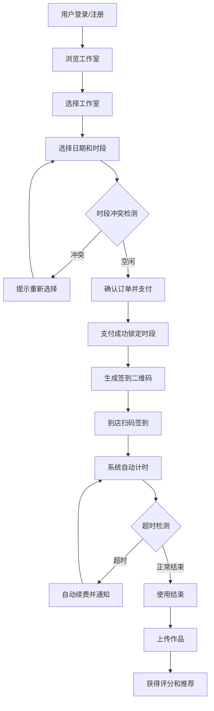

## 1. 产品概述

音乐工作室预约系统是一个面向音乐创作者和音乐爱好者的在线预约平台，提供专业录音室、乐器设备的时段预约服务，支持在线支付、扫码签到、作品上传与评分、智能推荐等完整业务闭环。

- 核心目标：解决音乐工作室预约难、管理效率低的痛点，提供透明化、自动化的预约体验
- 目标用户：音乐制作人、歌手、乐队、音乐爱好者及工作室运营管理者
- 市场价值：提升工作室利用率，优化定价策略，构建音乐创作者社区

## 2. 核心功能

### 2.1 用户角色

| 角色 | 注册方式 | 核心权限 |
|------|----------|----------|
| 普通用户 | 手机号/邮箱注册 | 浏览工作室、预约时段、支付、签到、上传作品、查看评分 |
| 管理员 | 后台账号登录 | 工作室管理、预约管理、数据看板、定价策略、报表导出 |

### 2.2 功能模块

1. **首页**：工作室展示、热门推荐、快速预约入口
2. **预约页面**：日历选择、时段空闲状态、冲突检测、在线支付
3. **作品广场**：作品列表、播放点赞、智能推荐、评分展示
4. **个人中心**：我的预约、我的作品、账户信息、签到二维码
5. **管理员看板**：使用率统计、时段热度、收入趋势、定价建议、报表导出

### 2.3 页面详情

| 页面名称 | 模块名称 | 功能描述 |
|----------|----------|----------|
| 首页 | 工作室卡片 | 展示各工作室图片、名称、价格、设备配置 |
| 首页 | 热门推荐 | 智能推荐高热度工作室和作品 |
| 首页 | 快速预约 | 日期选择器 + 时段快速跳转 |
| 预约详情页 | 日历选择 | 月视图日历，标记已预约/空闲状态 |
| 预约详情页 | 时段选择 | 时间段列表，实时显示空闲/已占用状态，自动检测冲突 |
| 预约详情页 | 支付确认 | 价格计算、支付方式选择、订单确认 |
| 预约详情页 | 订单管理 | 预约记录、取消预约、退款申请 |
| 作品广场 | 作品列表 | 音频/视频作品卡片，支持播放、点赞、评论 |
| 作品广场 | 智能推荐 | 根据播放量、点赞热度推荐作品 |
| 作品上传页 | 上传表单 | 音频/视频文件上传、封面、标题、描述 |
| 个人中心 | 我的预约 | 待使用/已完成/已取消预约列表 |
| 个人中心 | 我的作品 | 已上传作品管理、查看评分数据 |
| 个人中心 | 签到二维码 | 预约时段的签到码，扫码入场 |
| 管理员看板 | 使用率统计 | 各工作室使用率饼图/柱状图 |
| 管理员看板 | 时段热度 | 时段热力图，展示高峰时段 |
| 管理员看板 | 收入趋势 | 日/周/月收入折线图 |
| 管理员看板 | 定价建议 | AI预测高峰时段，自动建议调整定价 |
| 管理员看板 | 报表导出 | 月度运营报表导出，含营收、时长、满意度 |

## 3. 核心流程

### 预约流程
用户选择工作室 → 选择日期和时段 → 系统检测冲突 → 确认订单 → 在线支付 → 支付成功锁定时段 → 生成签到二维码 → 到店扫码签到 → 系统自动计时 → 超时自动续费 → 使用结束 → 上传作品 → 获得评分

### 管理流程
管理员登录 → 查看实时数据看板 → 分析时段热度和收入趋势 → 查看定价建议 → 调整价格策略 → 导出月度报表

## 4. 用户界面设计

### 4.1 设计风格
- **主色调**：深邃紫色 (#6366f1) 搭配金色 (#f59e0b) 点缀，体现音乐艺术感和专业品质
- **辅助色**：深灰背景 (#0f172a)、卡片深色 (#1e293b)、文字浅色 (#f1f5f9)
- **整体风格**：暗色主题，现代简约，音乐科技感，带有渐变光效和玻璃态效果
- **按钮风格**：圆角胶囊按钮，渐变背景，悬停时有辉光效果
- **字体**：标题使用 Playfair Display 衬线体，正文使用 Inter 无衬线体，营造艺术与现代的平衡
- **布局风格**：卡片式布局，网格排列，大留白，不对称构图
- **图标风格**：Lucide 线性图标，统一 24px 尺寸

### 4.2 页面设计概览

| 页面名称 | 模块名称 | UI 元素 |
|----------|----------|---------|
| 首页 | Hero区域 | 大标题、渐变背景、搜索框、动画装饰元素 |
| 首页 | 工作室卡片 | 图片、标题、价格标签、设备图标、悬浮效果 |
| 首页 | 热门推荐 | 横向滚动卡片、渐变遮罩、播放按钮 |
| 预约页 | 日历组件 | 月视图、日期状态标记、左右切换动画 |
| 预约页 | 时段网格 | 时间块网格、空闲/已占用状态色、点击选中效果 |
| 预约页 | 支付面板 | 价格明细、支付方式图标、确认按钮 |
| 作品广场 | 作品卡片 | 封面图、播放按钮、点赞数、评分星星 |
| 作品广场 | 推荐区 | 大尺寸推荐位、渐变文字、动画效果 |
| 个人中心 | 侧边导航 | 图标+文字、选中态高亮、平滑过渡 |
| 个人中心 | 预约卡片 | 状态标签、时间信息、签到码按钮 |
| 管理员看板 | 数据卡片 | 大数字、趋势箭头、图表缩略 |
| 管理员看板 | 图表区域 | 多图表网格布局、图例、交互提示 |

### 4.3 响应式
- 桌面端优先设计（1280px+），适配平板（768px）和移动端（375px）
- 移动端采用单列布局，底部导航栏替代顶部导航
- 触控元素尺寸不小于 44px，优化触摸体验
- 图表在移动端自适应缩放，支持横向滚动查看

### 4.4 动效设计
- 页面切换采用淡入淡出 + 轻微位移过渡
- 卡片悬浮有上浮效果 + 阴影加深
- 按钮点击有缩放反馈
- 数据加载采用骨架屏动画
- 数字增长有计数动画效果
