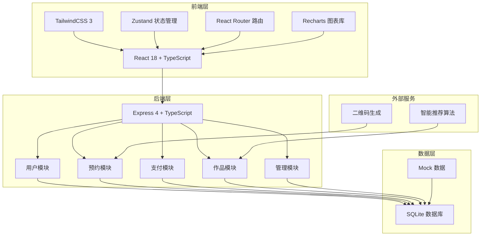
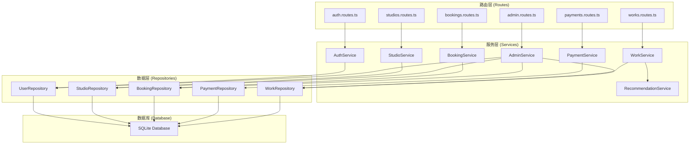
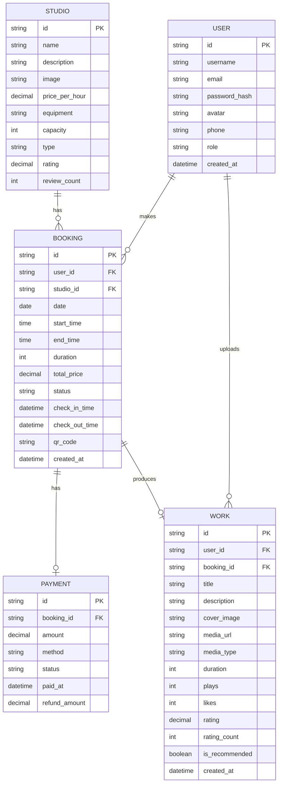

## 1. 架构设计



## 2. 技术栈说明

- **前端**：React 18 + TypeScript + TailwindCSS 3 + Vite
- **状态管理**：Zustand
- **路由**：React Router DOM 6
- **图表**：Recharts
- **图标**：Lucide React
- **后端**：Express 4 + TypeScript
- **数据库**：SQLite（本地开发，内置 mock 数据）
- **二维码**：qrcode 库
- **初始化工具**：vite-init

## 3. 路由定义

| 路由路径 | 页面名称 | 说明 |
|----------|----------|------|
| / | 首页 | 工作室展示、热门推荐 |
| /booking/:id | 预约详情页 | 日历选择、时段选择、支付 |
| /works | 作品广场 | 作品列表、智能推荐 |
| /works/upload | 作品上传页 | 音频/视频上传 |
| /profile | 个人中心 | 我的预约、我的作品 |
| /profile/bookings | 我的预约 | 预约列表、签到码 |
| /profile/works | 我的作品 | 作品管理 |
| /login | 登录页 | 用户登录/注册 |
| /admin | 管理员看板 | 数据统计、报表导出 |
| /admin/studios | 工作室管理 | 工作室CRUD |
| /admin/bookings | 预约管理 | 预约查询、管理 |

## 4. API 定义

### 4.1 用户模块

```typescript
// 类型定义
interface User {
  id: string;
  username: string;
  email: string;
  avatar?: string;
  phone?: string;
  role: 'user' | 'admin';
  createdAt: string;
}

interface LoginRequest {
  email: string;
  password: string;
}

interface RegisterRequest {
  username: string;
  email: string;
  password: string;
  phone?: string;
}

interface AuthResponse {
  user: User;
  token: string;
}

// API 接口
// POST /api/auth/login - 用户登录
// POST /api/auth/register - 用户注册
// GET /api/auth/profile - 获取用户信息
// PUT /api/auth/profile - 更新用户信息
```

### 4.2 工作室模块

```typescript
interface Studio {
  id: string;
  name: string;
  description: string;
  image: string;
  pricePerHour: number;
  equipment: string[];
  capacity: number;
  type: string;
  rating: number;
  reviewCount: number;
}

// API 接口
// GET /api/studios - 获取工作室列表
// GET /api/studios/:id - 获取工作室详情
// POST /api/studios - 创建工作室 (管理员)
// PUT /api/studios/:id - 更新工作室 (管理员)
// DELETE /api/studios/:id - 删除工作室 (管理员)
```

### 4.3 预约模块

```typescript
interface Booking {
  id: string;
  userId: string;
  studioId: string;
  studioName: string;
  date: string;
  startTime: string;
  endTime: string;
  duration: number;
  totalPrice: number;
  status: 'pending' | 'paid' | 'confirmed' | 'in_use' | 'completed' | 'cancelled' | 'no_show';
  checkInTime?: string;
  checkOutTime?: string;
  qrCode: string;
  createdAt: string;
}

interface TimeSlot {
  startTime: string;
  endTime: string;
  available: boolean;
  bookingId?: string;
}

// API 接口
// GET /api/bookings - 获取我的预约列表
// GET /api/bookings/:id - 获取预约详情
// POST /api/bookings - 创建预约
// GET /api/studios/:id/availability?date=YYYY-MM-DD - 获取某日时段可用性
// POST /api/bookings/:id/checkin - 扫码签到
// POST /api/bookings/:id/renew - 续费延长
// POST /api/bookings/:id/cancel - 取消预约
// GET /api/bookings/:id/qrcode - 获取签到二维码
```

### 4.4 支付模块

```typescript
interface Payment {
  id: string;
  bookingId: string;
  amount: number;
  method: 'wechat' | 'alipay' | 'card';
  status: 'pending' | 'success' | 'failed' | 'refunded';
  paidAt?: string;
  refundAmount?: number;
}

// API 接口
// POST /api/payments - 创建支付
// GET /api/payments/:id - 获取支付状态
// POST /api/payments/:id/refund - 申请退款
```

### 4.5 作品模块

```typescript
interface Work {
  id: string;
  userId: string;
  username: string;
  userAvatar?: string;
  title: string;
  description: string;
  coverImage: string;
  mediaUrl: string;
  mediaType: 'audio' | 'video';
  duration: number;
  plays: number;
  likes: number;
  rating: number;
  ratingCount: number;
  createdAt: string;
  isRecommended?: boolean;
}

// API 接口
// GET /api/works - 获取作品列表（支持推荐、热门排序）
// GET /api/works/:id - 获取作品详情
// POST /api/works - 上传作品
// POST /api/works/:id/like - 点赞/取消点赞
// POST /api/works/:id/rating - 评分
// GET /api/works/recommended - 获取推荐作品
// GET /api/users/:id/works - 获取用户作品
```

### 4.6 管理员模块

```typescript
interface DashboardStats {
  totalRevenue: number;
  revenueGrowth: number;
  totalBookings: number;
  bookingsGrowth: number;
  totalUsers: number;
  usersGrowth: number;
  avgUtilization: number;
}

interface StudioStats {
  studioId: string;
  studioName: string;
  utilization: number;
  revenue: number;
  bookingCount: number;
  avgDuration: number;
}

interface TimeSlotHeat {
  hour: number;
  count: number;
}

interface RevenueTrend {
  date: string;
  revenue: number;
  bookings: number;
}

interface PricingSuggestion {
  studioId: string;
  studioName: string;
  peakHours: number[];
  offPeakHours: number[];
  suggestedPeakPrice: number;
  suggestedOffPeakPrice: number;
  currentPrice: number;
  expectedRevenueIncrease: number;
}

interface MonthlyReport {
  month: string;
  totalRevenue: number;
  totalBookings: number;
  totalHours: number;
  avgSatisfaction: number;
  studioReports: StudioMonthlyReport[];
}

interface StudioMonthlyReport {
  studioId: string;
  studioName: string;
  revenue: number;
  bookings: number;
  hours: number;
  utilization: number;
  avgSatisfaction: number;
}

// API 接口
// GET /api/admin/dashboard - 获取看板统计数据
// GET /api/admin/studio-stats - 获取各工作室统计
// GET /api/admin/timeslot-heat?date=YYYY-MM-DD - 获取时段热度
// GET /api/admin/revenue-trend?type=day|week|month - 获取收入趋势
// GET /api/admin/pricing-suggestions - 获取定价建议
// GET /api/admin/report/monthly?month=YYYY-MM - 获取月度报表
// GET /api/admin/report/monthly/export?month=YYYY-MM - 导出月度报表
```

## 5. 服务端架构图



## 6. 数据模型

### 6.1 数据模型 ER 图



### 6.2 数据库初始化脚本

```sql
-- 用户表
CREATE TABLE IF NOT EXISTS users (
  id TEXT PRIMARY KEY,
  username TEXT NOT NULL,
  email TEXT UNIQUE NOT NULL,
  password_hash TEXT NOT NULL,
  avatar TEXT,
  phone TEXT,
  role TEXT DEFAULT 'user',
  created_at DATETIME DEFAULT CURRENT_TIMESTAMP
);

-- 工作室表
CREATE TABLE IF NOT EXISTS studios (
  id TEXT PRIMARY KEY,
  name TEXT NOT NULL,
  description TEXT,
  image TEXT,
  price_per_hour REAL NOT NULL,
  equipment TEXT, -- JSON array
  capacity INTEGER,
  type TEXT,
  rating REAL DEFAULT 0,
  review_count INTEGER DEFAULT 0
);

-- 预约表
CREATE TABLE IF NOT EXISTS bookings (
  id TEXT PRIMARY KEY,
  user_id TEXT NOT NULL,
  studio_id TEXT NOT NULL,
  date TEXT NOT NULL,
  start_time TEXT NOT NULL,
  end_time TEXT NOT NULL,
  duration INTEGER NOT NULL,
  total_price REAL NOT NULL,
  status TEXT DEFAULT 'pending',
  check_in_time TEXT,
  check_out_time TEXT,
  qr_code TEXT,
  created_at DATETIME DEFAULT CURRENT_TIMESTAMP,
  FOREIGN KEY (user_id) REFERENCES users(id),
  FOREIGN KEY (studio_id) REFERENCES studios(id)
);

-- 支付表
CREATE TABLE IF NOT EXISTS payments (
  id TEXT PRIMARY KEY,
  booking_id TEXT NOT NULL,
  amount REAL NOT NULL,
  method TEXT,
  status TEXT DEFAULT 'pending',
  paid_at TEXT,
  refund_amount REAL,
  FOREIGN KEY (booking_id) REFERENCES bookings(id)
);

-- 作品表
CREATE TABLE IF NOT EXISTS works (
  id TEXT PRIMARY KEY,
  user_id TEXT NOT NULL,
  booking_id TEXT,
  title TEXT NOT NULL,
  description TEXT,
  cover_image TEXT,
  media_url TEXT NOT NULL,
  media_type TEXT NOT NULL,
  duration INTEGER DEFAULT 0,
  plays INTEGER DEFAULT 0,
  likes INTEGER DEFAULT 0,
  rating REAL DEFAULT 0,
  rating_count INTEGER DEFAULT 0,
  is_recommended INTEGER DEFAULT 0,
  created_at DATETIME DEFAULT CURRENT_TIMESTAMP,
  FOREIGN KEY (user_id) REFERENCES users(id),
  FOREIGN KEY (booking_id) REFERENCES bookings(id)
);

-- 点赞表
CREATE TABLE IF NOT EXISTS work_likes (
  id TEXT PRIMARY KEY,
  user_id TEXT NOT NULL,
  work_id TEXT NOT NULL,
  created_at DATETIME DEFAULT CURRENT_TIMESTAMP,
  UNIQUE(user_id, work_id)
);

-- 评分表
CREATE TABLE IF NOT EXISTS work_ratings (
  id TEXT PRIMARY KEY,
  user_id TEXT NOT NULL,
  work_id TEXT NOT NULL,
  rating INTEGER NOT NULL,
  created_at DATETIME DEFAULT CURRENT_TIMESTAMP,
  UNIQUE(user_id, work_id)
);

-- 索引
CREATE INDEX IF NOT EXISTS idx_bookings_studio_date ON bookings(studio_id, date);
CREATE INDEX IF NOT EXISTS idx_bookings_user ON bookings(user_id);
CREATE INDEX IF NOT EXISTS idx_works_user ON works(user_id);
CREATE INDEX IF NOT EXISTS idx_works_recommended ON works(is_recommended);
```
